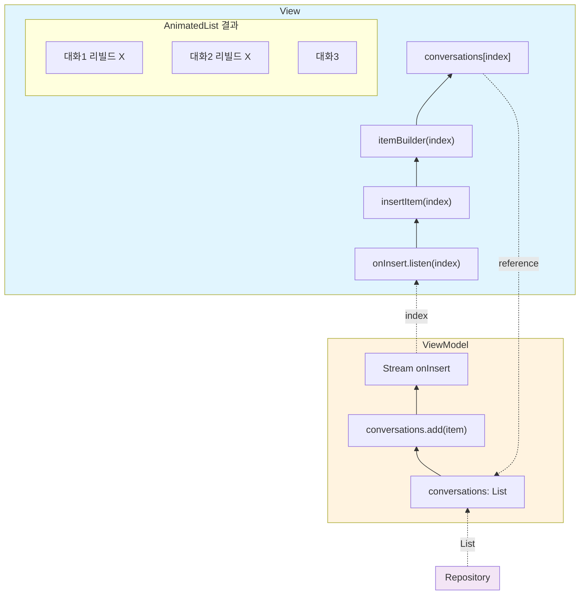

# 모바일 청첩장

TBD 이미지

Flutter 기반 모바일 청첩장 프로젝트입니다.
설정 파일 하나만 수정하면 나만의 청첩장을 만들 수 있습니다.

## 시작하기

### Step 1. 이 저장소 Fork

1. 이 저장소 우측 상단의 **Fork** 버튼 클릭
2. 내 GitHub 계정으로 저장소가 복사됩니다

### Step 2. GitHub Actions 활성화

Fork 직후에는 Actions가 비활성화 상태입니다.

1. Fork한 저장소의 **Actions** 탭 클릭
2. **"I understand my workflows, go ahead and enable them"** 버튼 클릭

### Step 3. GitHub Pages 설정

1. **Settings** 탭 > 좌측 메뉴 **Pages** 클릭
2. **Source**를 **GitHub Actions**로 변경

### Step 4. 내 정보로 설정 파일 수정

`lib/config/wedding_config.dart` 파일을 열어 내 정보로 수정합니다.

GitHub 웹에서 직접 편집하거나, 저장소를 clone하여 로컬에서 수정할 수 있습니다.

파일은 화면에 나타나는 순서대로 정렬되어 있습니다:

| 섹션 | 설명 | 주요 항목 |
|------|------|----------|
| 0. 공통 설정 | 앱 이름, 프로필 사진 | `appTitle`, `profileImage` |
| 1. 첫 화면 | 메인 이미지, 신랑/신부 이름 | `groomName`, `brideName`, `introImage` |
| 2. 인사 + 웨딩 사진 | 인사말, 사진 앨범 | `inviteGreeting`, `localWeddingImages` |
| 3. 날짜/장소 | 날짜, 장소, 지도 | `dateVenueMessage`, `naverMapLink` |
| 4. 축의금 | 계좌번호 | `groomAccounts`, `brideAccounts` |
| 5. 신랑 성장과정 | 신랑 사진, 소개 | `localGroomHistoryImages`, `groomHistoryDescription` |
| 6. 신부 성장과정 | 신부 사진, 소개 | `localBrideHistoryImages`, `brideHistoryDescription` |
| 7. 매력 + 취미 | 매력 포인트, 취미 사진/영상 | `attractionAnswer`, `localHobbyImages` |
| 8. 엔딩 | 엔딩 메시지, 푸터 | `endingMessage`, `footerText` |
| 9. OG 태그 | SNS 공유 미리보기 | `ogTitle`, `ogDescription`, `ogImage` |

### Step 5. 이미지/영상 교체

- 로컬 이미지: `assets/images/` 폴더에 파일을 넣고 설정 파일의 경로를 수정
- 원격 이미지/영상: URL을 설정 파일에 직접 입력
- 동영상은 **50MB 이하**를 권장합니다. GitHub는 50MB 이상 파일에 경고를 표시하며, 100MB 이상은 업로드가 차단됩니다. ([GitHub Docs: Repository limits](https://docs.github.com/en/repositories/creating-and-managing-repositories/repository-limits))

### Step 6. 배포

설정 파일 수정 후 commit & push하면 GitHub Actions가 자동으로:

1. OG 태그가 반영된 `index.html` 생성
2. Flutter 웹 빌드
3. GitHub Pages에 배포

```bash
git add .
git commit -m "내 청첩장 설정 변경"
git push
```

배포가 완료되면 `https://<내 GitHub 아이디>.github.io/<저장소 이름>/` 에서 확인할 수 있습니다.

## 로컬에서 미리보기 (선택)

```bash
flutter run -d chrome
```

설정 파일 수정 후 저장하면 Hot Reload로 즉시 반영됩니다.

## 전체 구조



## 기술 스택

- Flutter Web
- GitHub Pages
- GitHub Actions (자동 빌드/배포)
